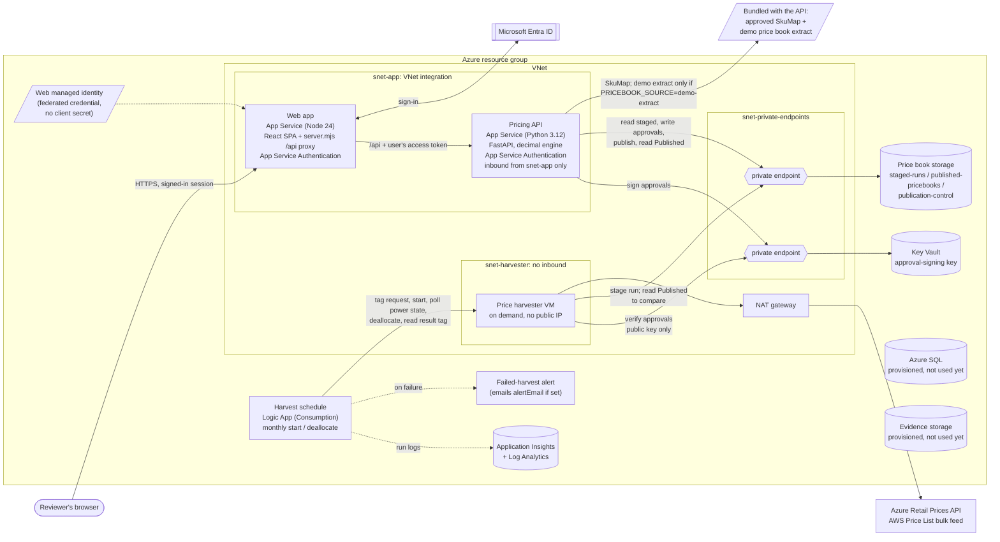

# Cloud Pricing Accelerator

A **cloud pricing tool** that prices one application across multiple clouds at public list prices.
This release prices Azure and AWS; adding another cloud means extending the harvester, the SkuMap, and
the pricing engine. Upload a completed migration intake workbook, answer the few questions the workbook
leaves open, and get:

- a short summary on top (each cloud's monthly run-rate at public list prices, the difference, and how
  complete the pricing is),
- the detail underneath: every priced line, the excluded-cost list, three commercial views (List, three-year
  Savings Plan, three-year Reservation), and a breakeven readout,
- a priced Excel workbook whose formulas recompute to the engine's totals, plus an evidence JSON file that
  reproduces the run hash.

The tool **informs** a platform decision; it does not make one. Every surface is labeled
"public-list run-rate benchmark", and every cloud's result is shown with the same layout and wording.

> **Solution accelerator, not a product.** Sample code under the MIT License. See
> [Disclaimer](#license-and-disclaimer) and [Demo vs production](#demo-vs-production) before you deploy.

## Contents

- [Architecture](#architecture)
- [Repository layout](#repository-layout)
- [Required software](#required-software)
- [Run locally](#run-locally)
- [Deploy to Azure](#deploy-to-azure)
- [Monthly cost](#monthly-cost)
- [Process map](docs/PROCESS-MAP.md): the price book loop, snapshot states, and the estimate flow
- [Operator guide](docs/OPERATOR-GUIDE.md): the monthly harvest, approval, failures, and rollback
- [Walk through the sample](#walk-through-the-sample)
- [Configuration](#configuration)
- [Tests](#tests)
- [Demo vs production](#demo-vs-production)
- [Design rules](#design-rules)
- [License and disclaimer](#license-and-disclaimer)

## Architecture



The monthly harvest stages a snapshot, a signed-in SkuMap reviewer and an approver sign it off on the
Price book page, and an approver publishes it ([process map](docs/PROCESS-MAP.md)). The API then prices from the current Published snapshot,
verified on load. Until the first snapshot is Published, pricing returns 503 rather than falling back to
demo rates.

| Component | Where | What it does |
| --- | --- | --- |
| Web app | `src/web` | React 19 + Vite single-page app. App Service Authentication signs users in with Entra ID. `server.mjs` serves the build and forwards `/api` calls to the API with the signed-in user's access token, so the browser never holds a token. The browser only formats numbers from the API; it never computes a price, total, delta, or percentage. |
| Pricing API | `src/api` | FastAPI. App Service Authentication validates each access token (tenant, audience, and that it came from the web app); the API then requires an app role (`Estimator` for estimates) and records the signed-in identity with every upload and answer. Validates the OpenXML intake, normalizes it to a cloud-neutral model, opens Gaps (questions) for missing facts, and prices each unit as multiple meters per cloud with Python `decimal`. Every result is stamped with a run hash. Builds the priced workbook and evidence JSON. |
| SkuMap + demo price book | `samples/*.json` | The SkuMap maps neutral units to provider meters; the demo extract holds real public prices from snapshot `trust-20260922e`. Each is bound to a digest in an approval record, and pricing fails closed if the bytes change. Both are bundled into the API package. The deployed API prices from the current Published snapshot; the demo extract prices only with `PRICEBOOK_SOURCE=demo-extract` (the local default) and is the first harvest's comparison baseline. |
| Price book storage | `infra/modules/pricebook-storage.bicep` | Private, versioned Blob account with soft delete. `staged-runs` holds harvested runs, `publication-control` holds signed approvals and the `current.json` pointer, and `published-pricebooks` holds Published snapshots. The API is the only writer outside staging. |
| Price harvester | `src/harvester`, `infra/modules/harvester-vm.bicep` | An on-demand VM in the app's VNet with no public IP and no inbound access. Streams the anonymous Azure and AWS public price feeds (egress through a NAT gateway), validates them against the current Published snapshot, and stages a snapshot in the price book storage account for human approval. Its identity can write only the staging container (and its own VM's tags). A Logic App starts it monthly; it harvests, records the result, and powers off, and the Logic App deallocates it and alerts on failure. |
| Harvest schedule | `infra/modules/harvest-schedule.bicep` | Consumption Logic App. Each month it tags a harvest request on the VM, starts it, polls its power state until it powers off, deallocates it, reads the result tag, and fails the run (raising the alert) unless the VM is deallocated and the harvest succeeded. Its identity can only read, start, deallocate, and tag the VM. |
| Network | `infra/modules/network.bicep` | One VNet: both apps integrate with `snet-app`; the API accepts traffic only from that subnet. Key Vault and the price book storage account are reached through private endpoints and private DNS. See `infra/README.md`. |
| Intake Function | `src/functions` | Blob-triggered intake shell. Deployment is locked off (`deployFunction` only allows `false`) until private networking is added. |
| Azure SQL, Storage, Key Vault | `infra/modules` | Provisioned with public network access disabled. Key Vault holds the key that signs snapshot approvals; the API reads staged snapshots and writes approval records in the price book account, both through private endpoints. SQL and the evidence Storage account are for the production roadmap (durable estimates, evidence); **the API does not use them yet**, and estimates are held in memory. |
| Application Insights, Log Analytics | `infra/modules` | Provisioned, and both apps receive the connection string, but neither app sends telemetry yet. |

v1 prices Windows and Linux IaaS VMs, attached block storage, and managed PostgreSQL. Anything else is
shown as Unpriced, never as zero.

## Repository layout

| Path | Contents |
| --- | --- |
| `src/api` | Pricing API and its tests (`src/api/README.md` lists every endpoint and field). |
| `src/web` | Review web app. Guided flow in `src/web/src/flow`, pages in `src/web/src/pages`. |
| `src/harvester` | Public-price harvester and its tests. |
| `src/functions` | Intake Function shell (not deployed). |
| `samples` | Synthetic intake workbook, its expected parse, an OLE2 reject sample, and the approved demo price book and SkuMap. All fictional; no customer data. |
| `infra` | Bicep: `main.bicep` (the app, network, price book storage, and harvester VM) and `modules/`. |
| `scripts/deploy-apps.ps1` | Packages and ZIP-deploys the API and web app. |
| `scripts/setup-entra.ps1` | Creates the two Entra app registrations for sign-in (run by someone who can create app registrations and grant admin consent). |
| `docs` | `PREREQUISITES.md` (decisions and people to line up first), `PROCESS-MAP.md` (process diagrams), and `OPERATOR-GUIDE.md` (monthly operation). |

## Required software

| Tool | Version | Used for |
| --- | --- | --- |
| [Git](https://git-scm.com/) | any recent | Clone the repo. |
| [Python](https://www.python.org/downloads/) | 3.12 | API and harvester. |
| [Node.js](https://nodejs.org/) | 24 or newer | Web app build and local dev server. |
| [PowerShell](https://learn.microsoft.com/powershell/scripting/install/installing-powershell) | 7.3 or newer | Commands below and the scripts in `scripts/`. |
| [Azure CLI](https://learn.microsoft.com/cli/azure/install-azure-cli) | 2.60 or newer, with Bicep (`az bicep install`) | Deploying to Azure. |

For Azure you also need a subscription where you can create a resource group and assign roles (Owner, or
Contributor plus User Access Administrator), and someone who can create Entra app registrations and grant
admin consent (Application Administrator or Cloud Application Administrator) to turn on sign-in.

## Run locally

From the repository root:

```powershell
# One-time setup
cd src\api
python -m venv .venv
.\.venv\Scripts\python.exe -m pip install -r requirements-dev.txt
cd ..\web
npm ci
cd ..\..
```

```powershell
# Terminal 1: API on port 8000 (in memory; a restart clears estimates)
cd src\api
$env:AUTH_MODE = 'local'                      # developer machines only; refused on Azure
$env:LOCAL_PRINCIPAL_OID = '00000000-0000-0000-0000-000000000001'
$env:LOCAL_PRINCIPAL_NAME = 'Local Developer'
$env:LOCAL_PRINCIPAL_ROLES = 'Estimator'
$env:CORS_ORIGINS = 'http://localhost:5173'
$env:PRESENT_AWS_PRICING = 'true'
.\.venv\Scripts\python.exe -m uvicorn main:app --host 127.0.0.1 --port 8000
```

```powershell
# Terminal 2: web on port 5173
cd src\web
$env:VITE_API_BASE_URL = 'http://localhost:8000'
npm run dev
```

Open <http://localhost:5173> and choose **Try a sample run**, or start a **New estimate** and upload
`samples/synthetic_intake_completed.xlsx`. On macOS or Linux, use `.venv/bin/python` instead.

## Deploy to Azure

The template creates one resource group containing a VNet with a NAT gateway and private DNS, an App
Service plan (Linux B1) with the API and web apps, a user-assigned managed identity for web sign-in,
Application Insights, Log Analytics, Key Vault and a price book storage account (both behind private
endpoints), an evidence storage account, a Basic Azure SQL database, and the price harvester VM with its
data disk. Resource names are `<type>-<environmentName>-<6-character hash>`, so
two environments do not collide.

Sign-in is fail-closed. Until step 4 is done, the web app loads but every API call returns 503 ("Sign-in is
not configured").

1. **Sign in and pick the subscription.**

   ```powershell
   az login
   az account set --subscription "<subscription name or ID>"
   ```

2. **Preview, then deploy the infrastructure.** Pick a region and a short environment name (3-12 lowercase
   letters, digits, or hyphens). The harvester VM needs an SSH public key because Linux requires one. It
   has no inbound access, so the private key is never used, but **keep the public key**: Azure cannot change
   a VM's SSH key, so every later deployment must pass the same one. The snippet creates it once and reuses
   it; on another machine, read it back from the VM
   (`az vm show -g <rg> -n <harvesterVmName> --query "osProfile.linuxConfiguration.ssh.publicKeys[0].keyData" -o tsv`).

   ```powershell
   $sshKey = Join-Path $HOME '.ssh\cloud-pricing-pricing-dev-harvester'
   if (-not (Test-Path "$sshKey.pub")) { ssh-keygen -t ed25519 -f $sshKey -N '""' -C harvester }
   $params = @(
     '--location', 'eastus2',
     '--name', 'cloud-pricing',
     '--template-file', 'infra/main.bicep',
     '--parameters', 'infra/main.parameters.json',
       'location=eastus2',
       'environmentName=pricing-dev',
       "deployedBy=$(az account show --query user.name -o tsv)",
       "deployerObjectId=$(az ad signed-in-user show --query id -o tsv)",
       "harvesterAdminSshPublicKey=$((Get-Content "$sshKey.pub" -Raw).Trim())"
   )
   az deployment sub what-if @params
   az deployment sub create @params --query properties.outputs
   ```

   To deploy as a service principal, also pass `deployerPrincipalType=ServicePrincipal` and that
   principal's object ID.

3. **Deploy the application code.** The script builds the web app, packages the API with the approved demo
   price files, and ZIP-deploys both to the apps named in the deployment outputs. The API installs its
   Python packages on first start, which can take a few minutes.

   ```powershell
   ./scripts/deploy-apps.ps1 -DeploymentName cloud-pricing
   ```

   Then install the price harvester on its VM. The script packages `src/harvester`, installs it through
   Azure Run Command (the VM has no inbound access), and deallocates the VM. The monthly schedule starts it
   from then on. Rerun the script after changing harvester code. It refuses to touch a running VM, and Azure
   starts a newly created one, so deallocate it first on the first deployment.

   ```powershell
   $out = az deployment sub show --name cloud-pricing --query properties.outputs -o json | ConvertFrom-Json
   az vm deallocate --resource-group $out.resourceGroupName.value --name $out.harvesterVmName.value
   ./scripts/deploy-harvester.ps1 -DeploymentName cloud-pricing
   ```

4. **Turn on sign-in.** Run the setup script once (any user who can create app registrations). It reads the web host name and managed
   identity from the deployment outputs and creates two app registrations: `cloud-pricing-api` (the
   `user_impersonation` scope and the app roles `Estimator`, `SnapshotApprover`, `SkuMapReviewer`, with
   assignment required) and `cloud-pricing-web` (the sign-in client, with no client secret: a federated
   credential trusts the web app's managed identity). Pass group object IDs to assign roles to groups
   (group assignment needs Entra ID P1), or assign users afterwards under **Enterprise applications >
   cloud-pricing-api > Users and groups**.

   ```powershell
   ./scripts/setup-entra.ps1 -DeploymentName cloud-pricing -EstimatorGroupId <group-object-id>
   ```

   Tenant-wide consent for the web client needs an administrator. If you are not one, the script warns and
   prints the command for an admin; until then each user consents to the sign-in permissions (openid,
   profile, email, offline_access, User.Read) at first sign-in, where the tenant allows user consent. The
   app owner can assign roles to users. Use `-Prefix` when another deployment in the tenant already uses
   the `cloud-pricing-api` / `cloud-pricing-web` names.

   Then rerun the step 2 deployment with the three values the script prints:

   ```powershell
   $params += @('authTenantId=<tenant>', 'apiClientId=<api app id>', 'webClientId=<web app id>')
   az deployment sub create @params --query properties.outputs
   ```

   If the web app still opens without asking you to sign in, restart both apps
   (`az webapp restart -g <rg> -n <app>`) so they pick up the new authentication settings.

   Only users with the `Estimator` role can upload or view estimates. The `SkuMapReviewer` and
   `SnapshotApprover` roles sign off staged snapshots on the Price book page. One person may hold both
   roles; both sign-offs are still recorded separately (a two-person rule is deferred to v2).

5. **Publish the first price book.** Estimates return 503 until a snapshot is Published. Run the first
   harvest now rather than waiting for the schedule, then sign in to `webUrl` as a SkuMapReviewer and
   SnapshotApprover and review, approve, and publish it on the Price book page.
   [docs/OPERATOR-GUIDE.md](docs/OPERATOR-GUIDE.md) covers this and the monthly loop after it.

6. **Check it.** Open `webUrl`, sign in, and run the sample. Opening `apiUrl` directly returns 403: the API
   accepts traffic only from the web app's subnet. Your name and roles appear at the bottom of the left
   navigation.

To remove everything: `az group delete --name <resourceGroupName output>`. Key Vault is soft-deleted and
keeps its name for the retention period; purge it or use a new `environmentName` to redeploy.

## Monthly cost

Approximate pay-as-you-go list prices in USD for one environment with the default parameters, in eastus2,
from the Azure Retail Prices API (September 2026). Taxes, support plans, Entra ID licensing, and
discounts are not included, and prices differ by region and change over time. Check your own with the
[Azure pricing calculator](https://azure.microsoft.com/pricing/calculator/) before you commit.

| Resource | SKU | Basis | Approx. per month |
| --- | --- | --- | ---: |
| App Service plan (API and web apps) | Linux B1, 1 instance | $0.017/hour, always on | $12.41 |
| NAT gateway (harvester egress) | Standard | $0.045/hour, always on, plus $0.045/GB (about 1 GB per harvest) | $32.90 |
| Public IP (NAT gateway) | Standard, static | $0.005/hour | $3.65 |
| Private endpoints (Key Vault, price book storage) | 2 endpoints | $0.01/hour each, plus $0.01/GB | $14.60 |
| Private DNS zones | 2 zones | $0.50/zone | $1.00 |
| Harvester VM | Standard_D4s_v3, Linux | $0.192/hour while running; a harvest takes about 20 minutes, and the schedule checks every 10 minutes before it deallocates the VM, so about 30 billed minutes a month (the 6-hour run limit caps a stuck run at about $1.15) | $0.10 |
| Harvester OS disk | Premium SSD P6, 64 GiB | billed while the VM is deallocated | $9.28 |
| Harvester data disk | Premium SSD P10, 128 GiB | billed while the VM is deallocated | $17.92 |
| Azure SQL database (**provisioned, not used yet**) | Basic, 5 DTU | $0.161/day | $4.90 |
| Storage accounts (price book; evidence, **not used yet**) | StorageV2, Standard LRS, Hot | $0.0184/GB plus operations; a few GB including kept blob versions | about $1 |
| Key Vault | Standard | $0.03 per 10,000 operations; $0.15 per 10,000 signings with the RSA 3072 approval key | under $0.10 |
| Log Analytics and Application Insights | Pay-as-you-go | first 5 GB a month per billing account free, then $2.76/GB ingested; the app logs a few MB | about $0 |
| Logic App (harvest schedule) and failure alert | Consumption; 1 metric alert | about 30 built-in actions a run, within the first 4,000 free a month ($0.000025 each after); the first 10 alert time series are free ($0.10 each after) | about $0 |
| VNet, NSGs, NICs, managed identities; action group email (only if `alertEmail` is set) | | no charge at this volume | $0 |
| **Total** | | | **about $98** |

The harvester line assumes the VM is deallocated between harvests, as in the deploy steps above. A new
deployment starts it running, and the schedule won't touch a VM it did not start, so a VM left running
costs about $140 a month more.

Most of the cost is fixed, not per estimate: the NAT gateway and its IP (about $37), the harvester's
Premium SSD disks (about $27), the private endpoints (about $15), and the App Service plan (about $12).
If cost matters more than disk speed, switching both harvester disks to Standard HDD (S6 $3.01 and S10
$5.89) saves about $18 a month; a harvest is mostly downloads, so it is slower but still works. Deleting
the SQL database until durable estimates are built saves $4.90.

## Walk through the sample

1. **New estimate**, then choose a mode (Azure only, AWS only, or both) and confirm the region pair.
2. **Upload** `samples/synthetic_intake_completed.xlsx` (or use **Try a sample run** on Home). The app shows
   what it found and what it checked.
3. **Resolve** the open question (monthly runtime for one server). Enter your name once for "Confirmed by";
   every answer is recorded with it.
4. **Answer:** the summary line, both totals, and the "Not included" list. Open **Scope**, **Confidence**,
   or **Breakeven** for the proof.
5. **Export:** a printable summary, the priced workbook (in the mode's layout), and the evidence JSON.

The **Estimates** page links to the Builder views (Applications, Intakes, Review, Comparisons) for the
full line-by-line detail.

## Configuration

API (App Service settings, or environment variables locally):

| Setting | Default | Meaning |
| --- | --- | --- |
| `PRESENT_AWS_PRICING` | `false` (`true` in an azd deployment) | `true` shows both clouds by default. Strict `true`/`false`. The API always computes both. |
| `PRICEBOOK_SOURCE` | `demo-extract` locally, `published-blob` in the template | `published-blob` prices from the current Published snapshot and fails closed (503) if it is missing, fails verification, or is stale; it needs `PRICEBOOK_APPROVAL_MODE`. `demo-extract` uses the bundled demo rates. Any other value fails at startup. |
| `PRICEBOOK_MAX_AGE_DAYS` | `45` | `published-blob` only: days after `pricedAsOf` a snapshot may still price (1-366). |
| `PRICEBOOK_REFRESH_SECONDS` | `60` | `published-blob` only: how often the API re-verifies the current Published snapshot (5-3600). |
| `APPLICATION_MAX_AGE_HOURS` | `1` | How long an estimate is kept in memory. Positive decimal, 1 minute to 8760 hours; invalid values fail startup. |
| `AUTH_MODE` | none (required) | `appservice` in Azure: trusts only the identity App Service Authentication validated, and returns 503 if platform authentication is off. `local` on a developer machine: uses `LOCAL_PRINCIPAL_OID`, `LOCAL_PRINCIPAL_NAME`, and comma-separated `LOCAL_PRINCIPAL_ROLES`, and refuses to start on Azure. Missing or unknown values fail startup. |
| `PRICEBOOK_APPROVAL_MODE` | `off` | `azure` (set by the template) turns on snapshot review and approval with managed identity and the Key Vault signing key; `local` is for developer machines. See `src/api/README.md` for its settings. |
| `CORS_ORIGINS` | `http://localhost:5173` | Local mode only: comma-separated web origins allowed to call the API directly. In Azure the web app proxies `/api` on its own origin, so CORS is off. |

Web (`server.mjs` in Azure, Vite locally):

| Setting | Meaning |
| --- | --- |
| `API_UPSTREAM_URL` | API origin that `server.mjs` forwards `/api` calls to with the signed-in user's access token. Set by the template. HTTPS required except for localhost. |
| `API_BASE_URL` | Only when `API_UPSTREAM_URL` is not set: API URL the browser calls directly, served through `/config.json`. |
| `VITE_API_BASE_URL` | API URL for `npm run dev` only. |

## Tests

```powershell
cd src\api
.\.venv\Scripts\python.exe -m pytest -q        # API: intake, pricing, workflow, answer-first fields
cd ..\..
python -m pytest src\harvester\tests -q        # harvester (needs src\harvester\requirements.txt)
cd src\web
npm run build                                  # type-check and build
npm run test:server                            # server.mjs /api proxy header handling (Node built-in runner)
```

## Demo vs production

This accelerator is a working demo with deliberate limits. Read these before putting it in front of anyone:

- **Sign-in is on and the API accepts traffic only from the web app's subnet.** Every `/api` call also needs
  a valid Entra token issued to the web app. Estimates are shared by everyone with the `Estimator` role.
- **Prices come from the Published harvest** in Azure, labeled non-production while storage is mutable
  (WORM retention is deferred). Locally the API uses a frozen demo extract of real public prices. The
  RHEL software uplift on Azure is a visible placeholder assumption under both, and the Confidence panel
  shows whether it could change the answer.
- **The bundled approval records are demonstration data** signed with a demo HMAC key. Harvested snapshots
  are signed off in the web app and signed with the Key Vault key (non-production, mutable-pilot storage).
- **Estimates are not saved.** The API holds each estimate, with its uploaded intake and your answers
  to its open questions, only in memory:
  - It expires `APPLICATION_MAX_AGE_HOURS` after upload (default 1 hour; the templates don't change it).
    Answering questions does not extend it.
  - Every estimate is lost when the API restarts: a deploy, a settings change, App Service maintenance,
    or a crash.
  - Keep the App Service plan at one instance and the API at one worker process (the template runs
    `gunicorn -w 1`). Each process has its own memory, so with more workers or instances a request can
    reach one that doesn't hold the estimate.
  - It holds at most 1,000 estimates or 100 MiB of intake workbooks; past that, uploads are refused
    (HTTP 429) until older estimates expire.

  **The downloaded priced workbook and evidence JSON are the lasting record.** Both stay locked until the
  estimate is a ReviewBaseline: every open question answered, and no Unpriced line or license question
  that blocks pricing (a SQL Server unit always blocks). Download both files before the estimate expires.
  If it expires first, or never reaches ReviewBaseline, nothing is kept: upload the intake again and
  answer its questions again. The
  SQL database and evidence storage account are provisioned for durable storage but not used yet;
  durable estimates stay on the roadmap unless you need them.
- **Not built:** WORM-retained evidence and Decision recording, and the read-only
  Microsoft Foundry narration agent.

## Design rules

The rules that matter most when you change the code:

- **Deterministic math only.** Every price, total, percentage, and breakeven is computed in the API with
  `decimal` and covered by the run hash. The browser and any future AI agent only display numbers from the
  payload.
- **Broker.** No bias toward any cloud in math, wording, color, or SKU matching.
- **Multi-meter pricing** with a BOM-completeness check. One unit becomes several priced meters per cloud.
  Never an all-in SKU, never an automatic cheapest pick.
- **Never a silent zero.** A missing fact is an open question, Unpriced, or an approved Exclusion, and the
  excluded-cost list is always visible next to a figure.
- **Untrusted input.** OpenXML only, package-validated; workbook text is shown as text. An Intake with a
  formula in any part (whatever its encoding or part name), including conditional-formatting,
  data-validation, and defined-name formulas, is rejected, and the export refuses a source workbook that
  still carries one.
- **Human-approved mappings,** enforced by a content digest, not a flag.

## License and disclaimer

Released under the [MIT License](LICENSE). This is sample code, not a supported product.

Every figure it produces is a **public-list run-rate benchmark** built from the anonymous Azure Retail
Prices API and AWS Price List feeds at the time of harvest. It is not a quote, an invoice estimate, or a
platform recommendation. It excludes negotiated discounts, enterprise agreements, credits, support plans,
taxes, and anything marked Unpriced or Excluded. Prices change; validate any figure against the providers'
current pricing and your own agreements before relying on it. The bundled sample approval records are
demonstration data, not a real human sign-off.
