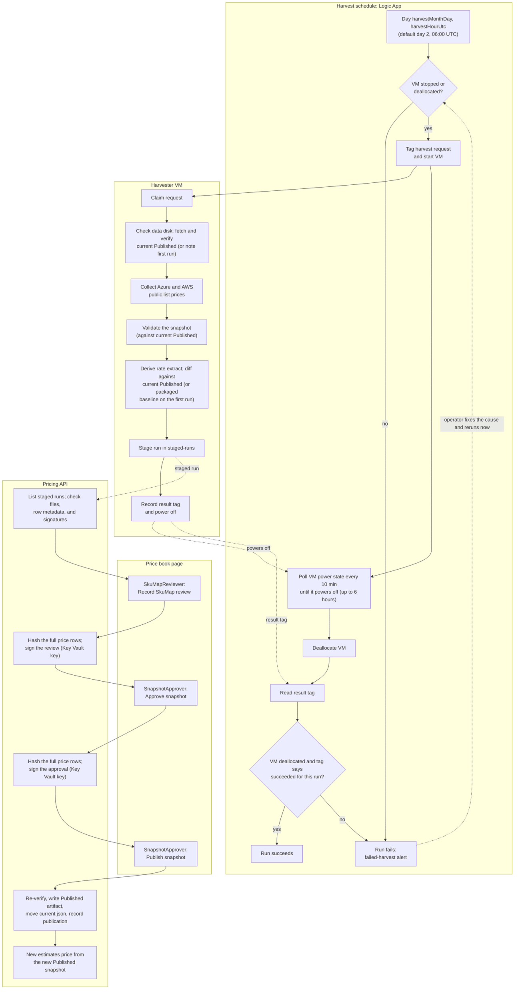
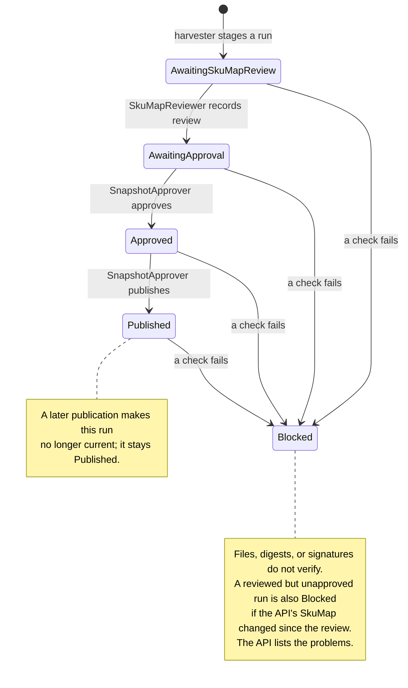
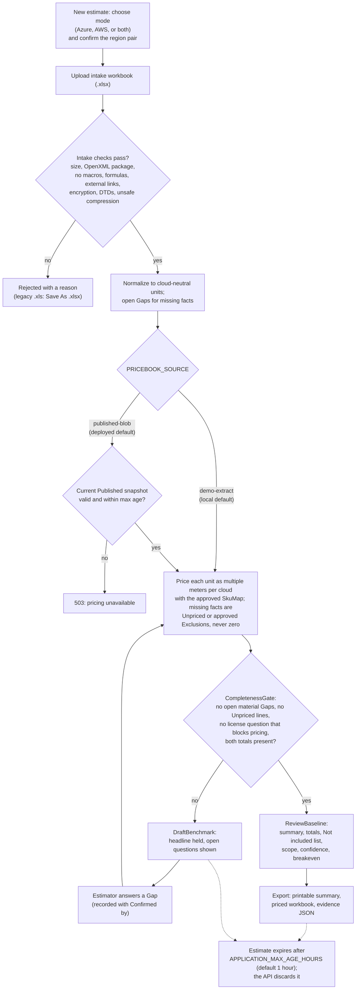

# Process map

Three processes run the accelerator. The first two keep the price book current; the third turns an
intake workbook into a priced comparison. The step-by-step procedures are in
[`OPERATOR-GUIDE.md`](OPERATOR-GUIDE.md); the components are in the README's "Architecture" section.

## 1. Monthly price book loop

Harvesting is automatic. Review, approval, and publishing are signed-in human actions on the web app's
**Price book** page. Nothing publishes on its own.

Review does not depend on the schedule's result. A run that staged before something later failed (for
example, deallocation or the result tag) still appears on the Price book page; check `staged-runs` after a
failed-harvest alert. A failed or unpublished month does not stop pricing: the current Published snapshot keeps pricing until
its capture date is more than `pricebookMaxAgeDays` old (default 45). The home page flags it as stale
after 30 days.

## 2. Staged run states

The Price book page shows each staged run in one of these states. The API computes the state from
verified records; the browser only displays it.

A SkuMap change does not move Approved or Published runs to Blocked, but the pricing engine refuses a
Published snapshot approved against a different SkuMap, so estimates return 503 until a snapshot approved
against the current SkuMap is Published. One person may hold both sign-off roles; the review and approval are still recorded separately. If
publishing is interrupted after `current.json` moved, the run reports that publishing did not finish and
pricing stops until **Publish snapshot** is selected again on the same run.

## 3. Estimate flow

An Estimator turns an intake workbook into a comparison. Every number comes from the API, computed with
`decimal` and stamped with a run hash.

The priced workbook and evidence JSON export only at ReviewBaseline. Estimates are held in memory, so
download both files before the estimate expires. The browser may still list an expired estimate by name,
but its workbook and comparison are gone.
